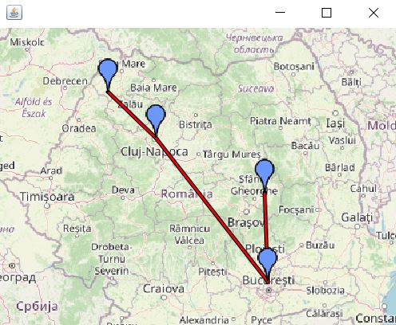

# Aplicație Airways Route Management System

Airways Route Management System

Această aplicație este un sistem de management al punctelor de trecere aeriene (Waypoints) și al rutelor de zbor. Permite crearea, salvarea, listarea și vizualizarea pe hartă a punctelor geografice, folosind un sistem de stocare bazat pe fișiere JSON. Harta se afișează la rulare, iar în main se pot introduce așazisele rute care vor apărea în fereastră ca și în imaginea de mai jos.

